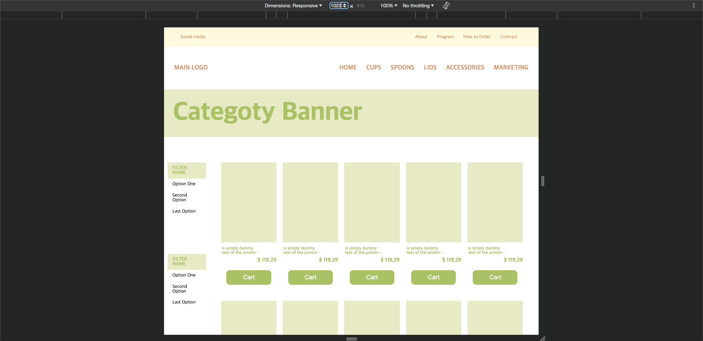

# flex를 사용한 반응형 웹 퍼블리싱

## 미디어 쿼리 기준

> A : min-width: 1280px ~

> B : min-width: 1024px ~ max-width: 1279px

> C : min-width: 768px ~ max-width: 1023px

> D : ~ max-width: 767px

### A

### B

### C

### D

